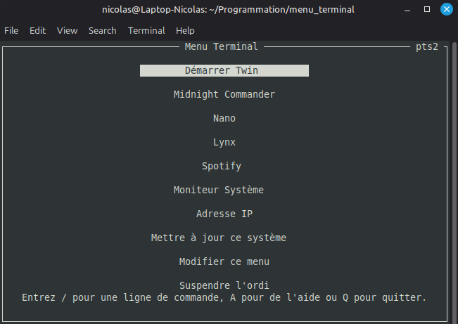

# Atelier C

### Programmation d'un menu d'application dans le terminal

## Informations
- Date: **5 Juin 2026**
- Local: **B1008** (pavillon Lucien-Brault)
- Durée: environ 2 heures

## Préparation
Pour cet atelier, vous devrez utiliser une distribution Linux de votre choix (machine virtuelle ou installation complète), un Mac ou WSL (*Windows Subsystem for Windows*). Des instrustions pour installer WSL sont disponibles dans ce [fichier](wsl.md).

Durant cet atelier, nous utiliserons la bibliothèque ncurses et le compilateur `gcc` ou `clang`. Assurez-vous d'avoir installé un de ces 2 compilateur ainsi que les en-tête de développement ncurses.

Vous pouvez utiliser un IDE comme VSCode ou tout simplement un éditeur de texte et votre terminal. Si vous utilisez VSCode, assurez-vous que vous compilez avec `gcc` ou `clang`. Le compilateur C de Microsoft ne sera PAS supporté.

### Instructions pour installer gcc et ncurses sur Debian, Ubuntu, Linux Mint, etc.
1. Ouvrez un terminal
2. Tapez `sudo apt update`, puis Enter
3. Tapez `sudo apt install build-essential libncurses-dev`, puis Enter

## Ce que nous couvrirons dans l'atelier
- Concepts et applications de base du C
- Création d'une interface TUI (Terminal User Interface) avec ncurses
- Gestion des erreurs en C
- Allocation et gestion de la mémoire en C
- Lecture de fichiers en C
- Création de threads en C (si le temps le permet)
- Etc.
