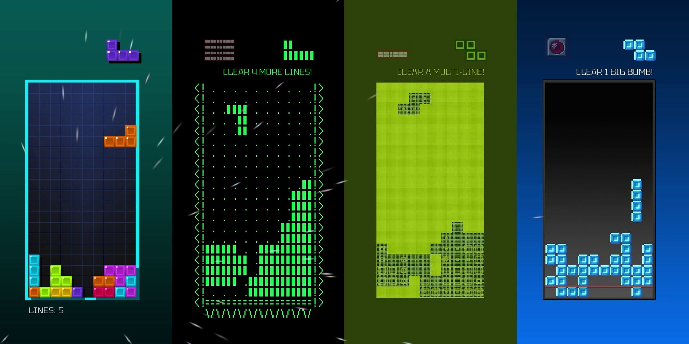
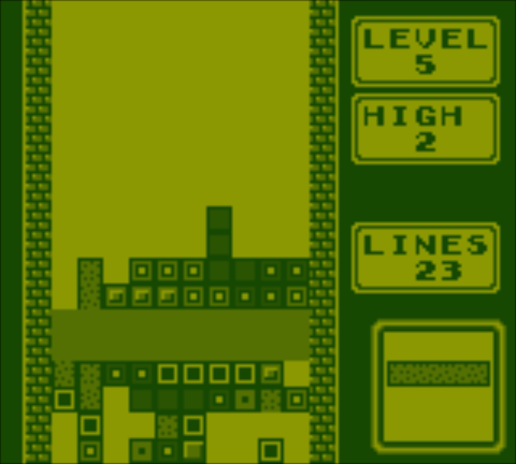
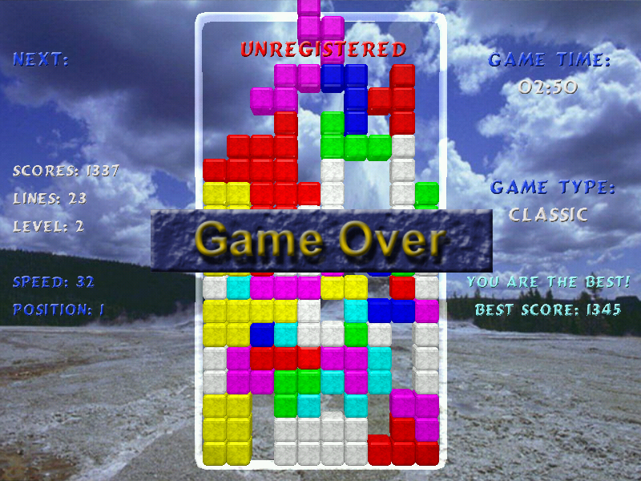
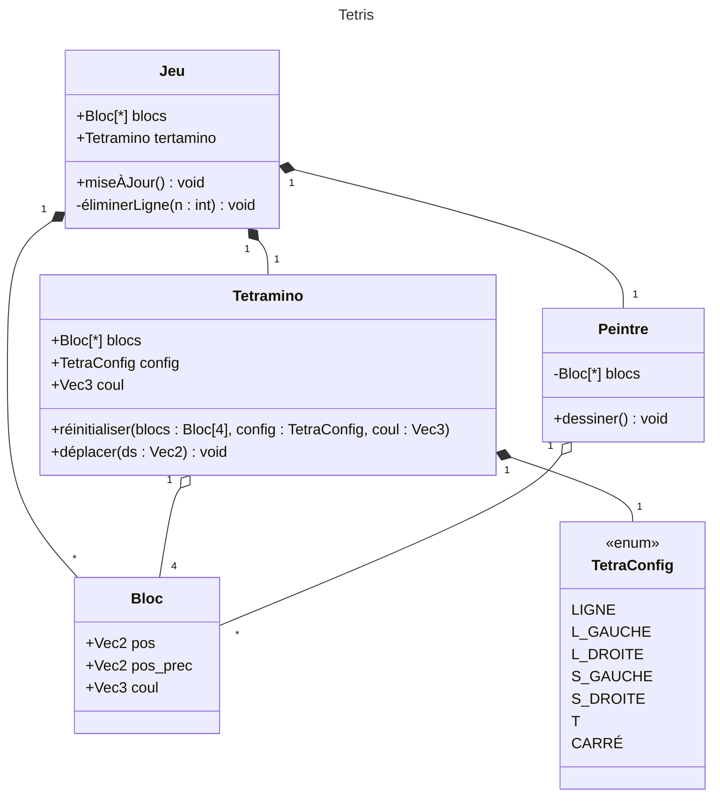

# Atelier Java 2026

- [Atelier Java 2026](#atelier-java-2026)
  - [Introduction](#introduction)
  - [Conception](#conception)

## Introduction

Ceci est l'Atelier Java 2026 de l'UQODE. L'objectif est de faire pratiquer la programmation dans un environnement guidé. Le format de cet atelier suivrat un modèle magistral interactif. Ainsi, je présenterai à l'avant et par moment, je vous poserai des questions. Vous êtes alors encouragés à discuter avec votre/vos voisin.es pour trouver la meilleure solution. Nous discuterons alors de vos réponses en groupe. Par contrainte de temps, ces réponses ne pourront pas modifier le code que je présenterai, mais vous êtes encouragés à l'implémenter par vous-même. Pour les sections de code, vous êtes encouragés à travailler en équipe pour l'écrire. Le thème de cet atelier est un jeu de Tetris.

### Question 1 : Connaissez-vous Tetris ? <!-- omit in toc -->

Tetris est un jeux vidéo simple dans lequel on tente de placer des pièces de casse-tête formées de quatre carrés *(appelés tetraminos ou tetrominos)* sur un plateau de façon à le remplir. Les pièces apparaissent en haut de l'écran et descendent jusqu'à toucher quelque chose. [Vous pouvez tester le jeux par vous-même ici.](https://play.tetris.com/)

*Exemples de jeux Tetris à travers les années*

Lorsqu'une ligne est remplie, elle disparait et les blocs au-dessus tombent jusqu'à toucher quelque chose.

*Dans cette partie, deux lignes ont été complétées et seront retirée.*

Une fois que les blocs atteignent le sommet de l'écran, la partie se termine.

*Un exemple de partie terminée*

Le joueur peut aussi déplacer ses tetraminos de droite à gauche, accélérer sa chute ou le faire tourner. Finalement, dans la plupart des instances du jeux, le joueur peut appercevoir la prochaine pièce qui sortira et son score.

## Conception

Nous implémenterons le jeu tel qu'il a originallement été conçus : ~~dans un état totalitaire soviétique~~ dans un terminal.

Voici donc la liste des fonctionnalités dont nous aurons besoin : 

1. Afficher l'état du jeu dans le terminal
2. Mettre à jour l'affichage de manière efficace
3. Faire tomber un tetramino sur l'écran et l'arrêter lorsqu'il touche quelque chose
4. Permettre au joueur de contrôler la chute du tetramino
5. Détecter et éliminer les lignes pleines
6. Afficher le score et le prochain tetramino

Avant de commencer à programmer, il est important de planifier son approche, de savoir ce qu'on va écrire dans le code. Ainsi, nous prendrons un moment pour concevoir la structure de notre programme.

La question la plus complexe à laquelle vous aurez à vous confronter est celle de la dualité entre le concept de bloc et de tetramino. En effet, il est clair que le joueur opère sur des tetraminos à l'écran, mais dès qu'ils touchent le sol, ils cessent d'agir en tant que tel : ils sont déformés et mélangés et chaque bloc agit dès lors individuellement. Il vous faut donc trouver une structure qui puisse rendre compte de ces deux réalités de fançons efficace.

### Question 2 : Concevez une structure pour votre programme. <!-- omit in toc -->

Voici la solution à laquelle je suis arrivé. Vous êtes encouragés à implémenter votre propre solution, mais par contrainte de temps, celle-ci serat celle que j'utiliserai : 

Remarquez les points suivants :

- Le tetramino est composé de quatre blocs qui sont sur l'écran. Un mouvement du tetramino est en réalité le mouvement de ses quatre blocs. Ceci permet de conserver un modèle du bloc, pour être mieux compris par les autres systèmes et de transformer le tetramino de manière très flexible.
- Le peintre n'a pas conscience des tetraminos, seulement des blocs, ce qui lui permet de se concentrer sur les blocs.
